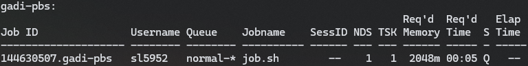
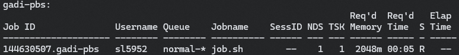
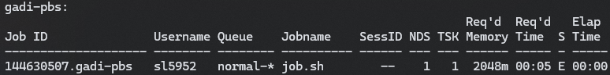

## What is Gadi?


> Credit: NCI Australia

Gadi is a high-performance computing (HPC) service provided by the National Computational Infrastructure (NCI) in Australia. It is designed to support a wide range of scientific and engineering applications, providing users with access to powerful computing resources.

It is particularly useful for tasks that require significant computational power, such as simulations, data analysis, and machine learning.

This guide provided a basic overview of how to use Gadi for high-performance computing tasks, including accessing the system, running Python scripts, managing dependencies, and monitoring job status.

### 1. Accessing Gadi

To access Gadi, you need to have an account and SSH access. Use the following command to connect:

```bash
ssh <username>@gadi.nci.org.au
```

Then, system will prompt you for your password. Once logged in, you can start using the system.

### 2. Gadi Overview

Before we start using Gadi, let's take a look at some of the key components:

### 3. Usage Example

In this section, we will run a simple Example to demonstrate how to use run those python scripts needs additional packages.

First, go to `/scratch/<project_id>/<username>/` directory:

```bash
cd /scratch/<project_id>/<username>/
```

Then, create a new directory(or git clone) for your project:

```bash
mkdir my_project
cd my_project
```

Next, add `python3/python3.10.0` to your environment:

```bash
module add python3/python3.10.0
```

Now, you can use `pip` to install `uv`, and use `uv` to create a virtual environment:

```bash
pip3 install uv --user
```

```bash
uv venv
```

After that, you can activate the virtual environment:

```bash
source venv/bin/activate # directory name may vary
```

Now, you can install any additional packages you need using `uv pip install`:

```bash
uv pip install requests

# or

uv pip install -r requirements.txt
```

When you are done, you can deactivate the virtual environment and create a job script to run your Python script on Gadi.

```bash
deactivate
```

```bash
#!/bin/bash
#PBS -P <project_id>
#PBS -q gpuvolta
#PBS -l ngpus=0
#PBS -l ncpus=1
#PBS -l mem=2GB
#PBS -l walltime=00:01:00
#PBS -l wd
#PBS -l storage=scratch/<project_id>

source /scratch/<project_id>/<username>/venv/bin/activate
python3 -c "import requests; print('requests version:', requests.__version__)" >> output.txt
```

```bash
qsub -P <project_id> job.sh
```

### 4. Monitoring Your Job

After submitting your job, you can monitor its status using the `qstat` command:

```bash
qstat -u <username>
```

You may see below output:







There are three main statuses:
- **Queue (Q)**: The job is waiting to be scheduled.
- **Running (R)**: The job is currently running.
- **Ended (E)**: The job has completed.

### 5. Accessing Output

You may notice that the output of your job is saved in the `output.txt` file in your project directory. You can view it using:

```bash
cat output.txt
# requests version: 2.32.4
```

### 6. Conclusion

This guide provides a basic overview of how to use Gadi for high-performance computing tasks. You can extend this by running more complex scripts, managing dependencies, and optimizing your workflows.